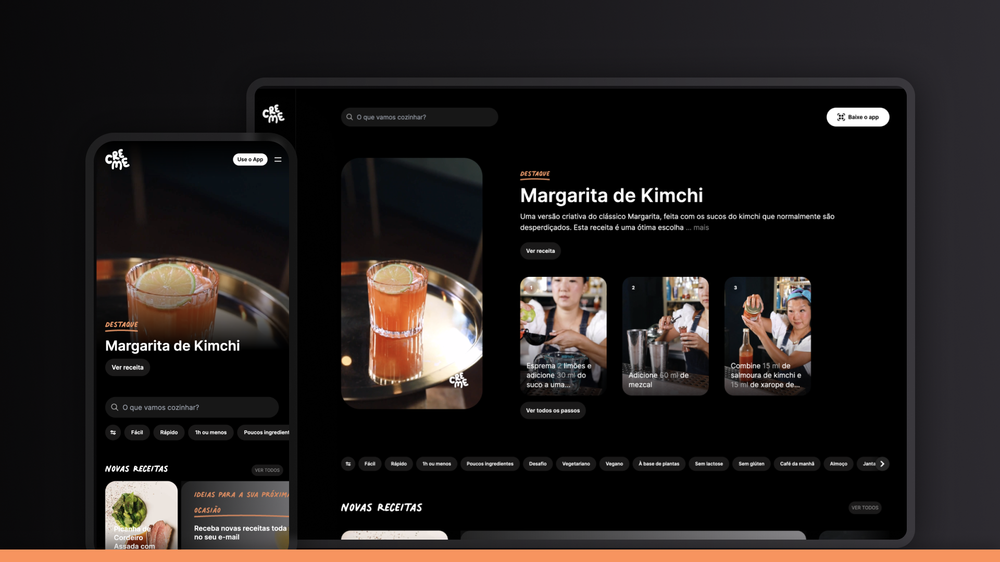

<strong><a href="https://creme.com/pt"><h1 align="center">CREME: Vídeos de Receitas Passo a Passo</h1></strong></a>

  

## 📚 Descrição

UI Clone do site [creme.com](https://creme.com/pt)

## 🚀 Tecnologias

- HTML
- CSS
- JavaScript

## 🎨 Layout

> Acesse o Figma desse projeto [neste link](https://www.figma.com/community/file/1290029569873017312/creme-com)

---

Feito com ♥ by [birobirobiro](https://birobirobiro.dev)
